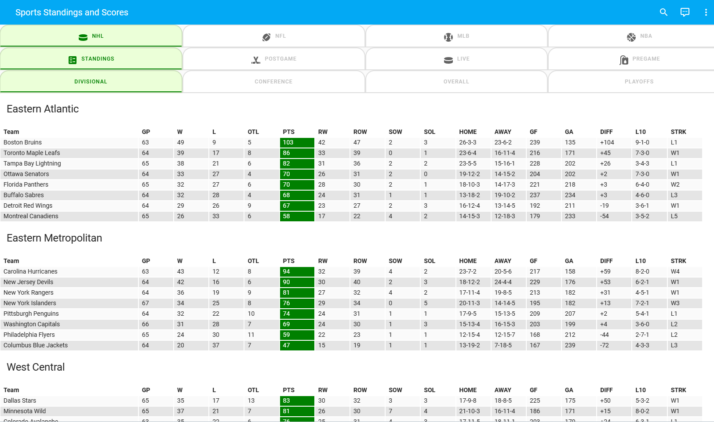
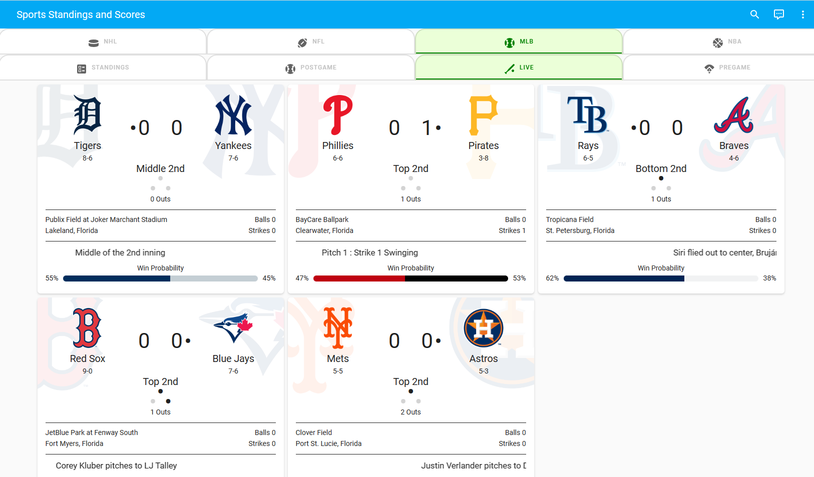

# Sport Standings and Scores

This project has Sports Standings and Scores Sensors and Dashboard for Home Assistant.
It contains NHL, NFL, MLB and NBA standings as well as pre-game, in-game and post-game statistics.
It makes use of the ESPN APIs as well as the great Teamtracker Home Assistant App and Card.

## Final Result

I always like to give you a glance at what you are building first. 
This helps you to understand the components and what goes into the solution. 
What we are building is shown here in the following images:

NHL Standings by Division



MLB Live Games



There are several components in this interface.
Across the top it uses tabs to allow selection of what you want to see:

- Select the Sport (NHL, MLB, NFL or NBA)
- Standings has Divisonal, Conference and Overall standings for each sport
- Note: the current view also has Playoff/Wildcard placeholder yet to be done
- Each sport has post-game, in-game and pre-game display

## Prerequisites

As for the GUI, there are several custom cards used. These include:

- [Teamtracker](https://github.com/vasqued2/ha-teamtracker)
- [Flex-Table](https://github.com/custom-cards/flex-table-card)
- [Layout](https://github.com/thomasloven/lovelace-layout-card)
- [Mod](https://github.com/thomasloven/lovelace-card-mod)
- [Tabbed](https://github.com/kinghat/tabbed-card)
- [Stack-in](https://github.com/custom-cards/stack-in-card)
- [Decluttering](https://github.com/custom-cards/decluttering-card)

You also would need the Teamtracker integration for the game-based statistics.
If you want the solution to work as is, you will need to be sure you have these installed and working in your Lovelace configuration.

## Sensors

There are several sensors. 
The main sensors can be broken down into two types.
The first is a single sensor for every sport that uses REST. 
These are in the GITHUB sensor.yaml file.
One example is:


```
##
## NFL Standings
##
- platform: rest
  scan_interval: 36000
  name: NFL Standings
  unique_id: sensor.nfl_standings
  resource: https://site.web.api.espn.com/apis/v2/sports/football/nfl/standings?seasontype=2&type=0&level=3
  value_template: "{{ now() }}"
  json_attributes:
      - children
```
In these REST sensors, it gets the data from the ESPN API using:

- seasontype = 2 (regular season)
- type = 0 (full stats)
- level = 3 (full/conference/division)

The other sensors in sensor.yaml are all teamtracker sensors for every team in all the sports.
A short (snipped) example is like this:

```
##
##  NFL Teams
##
- platform: teamtracker
  league_id: NFL
  team_id: DET
  name: Detroit Lions
- platform: teamtracker
  league_id: NFL
  team_id: GB
  name: Green Bay
- platform: teamtracker
  league_id: NFL
  team_id: CHI
  name: Chicago Bears
- platform: teamtracker
  league_id: NFL
  team_id: MIN
  name: Minnesota Vikings
- platform: teamtracker
  league_id: NFL
  team_id: BUF
  name: Buffalo Bills
- platform: teamtracker
  league_id: NFL
  team_id: MIA
  name: Miami Dolphins
```

The sensor.yaml attached has teamtracker sensors to every team in all those sports.

As a side note, I made these but I not type in every team. I use a tool to go JSON to XML using the JSON output from the standings file.
The repository includes an XSL that can build the set based on the sensor for a sport.
And yes, I used XML and XSL ... because that is what I am familar with and this is a one off.

In order to get standings for all the divisions, I implemented template sensors for all of them.
These are included in template.yaml in GITHUB.
A short sample is like this for the NHL:


```
###
### NHL Divisions
###
  - name: NHL East Atlantic
    unique_id: sensor.nhl_east_atlantic
    state: "{{ now() }}"
    attributes:
      entries: "{{ state_attr('sensor.nhl_standings','children')[0]['children'][0]['standings']['entries'] }}"
  - name: NHL East Metropolitan
    unique_id: sensor.nhl_east_metropolitan
    state: "{{ now() }}"
    attributes:
      entries: "{{ state_attr('sensor.nhl_standings','children')[0]['children'][1]['standings']['entries'] }}"
  - name: NHL West Central
    unique_id: sensor.nhl_west_central
    state: "{{ now() }}"
    attributes:
      entries: "{{ state_attr('sensor.nhl_standings','children')[1]['children'][0]['standings']['entries'] }}"
  - name: NHL West Pacific
    unique_id: sensor.nhl_west_pacific
    state: "{{ now() }}"
    attributes:
      entries: "{{ state_attr('sensor.nhl_standings','children')[1]['children'][1]['standings']['entries'] }}"
```

## The Dashboard

The complete dashboard is contained in dashboard.yaml. 
You can examine that and make changes you may want.
It makes extensive use of decluttering to templatize things and make it easier and much shorter to write.
I think I could go deeper here, but for now it has one template per sport (as the columns are different) and one for game stats.
It uses flex-table to show standings. 
There is a help_template in a .txt file that can help you identify the fields that contain the columns you wish to show in standings.

There are a few nice things done with card-mod to implement nicer tabs, colorize active tabs and provide scrolling tables horizontally on smaller displays.
Although I will say that I designed this for wall pads in the house with large screens, I would likely change things if I ever implemented it to target phone devices.
